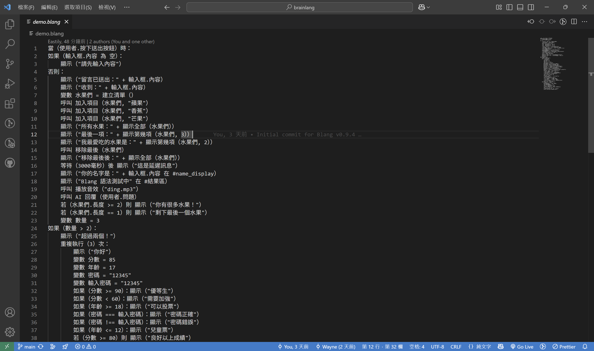
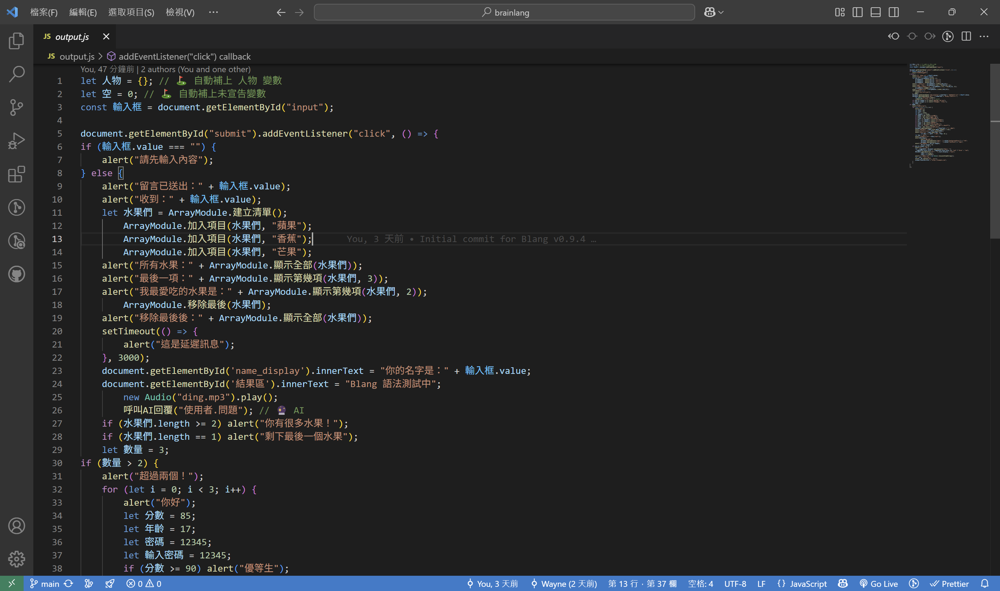

# 🌳 Blang v0.9.4 – 中文語意邏輯語言（Semantic Logic Edition）

> 用中文，說出邏輯。用語言，開啟智慧。

**Blang** 是一套以「中文語意」為核心邏輯的實驗性程式語言，讓你用直覺的語句編寫真正能執行的互動應用。
從命令到語境，從語法到語意，Blang 正在建構一套智慧語法的語言宇宙。

---

## 🚀 快速開始

### 📦 安裝與轉譯

```bash
git clone https://github.com/AIVIN311/blang-language.git
cd blang-language
node parser_v0.9.4.js
```

這將把 `demo.blang` 中文語法自動轉譯為 `output.js`，可嵌入 HTML 使用或直接在 Node.js 執行。

### 🛠️ 自訂語法

Blang 允許使用 `definePattern()` 擴充新的中文語法，建議將規則集中於 `customBlangPatterns.js` 中：

```js
definePattern('顯示 $內容', (內容) => `alert(${內容});`, {
  description: '彈出警示框顯示指定內容'
});
definePattern(
  '若 $條件 則 顯示 $當真 否則 顯示 $當假',
  (條件, 當真, 當假) => `if (${條件}) { alert(${當真}); } else { alert(${當假}); }`,
  { type: 'control', description: '根據條件顯示不同內容' }
);
```

可在第三個參數傳入 `{ type }` 以標記模式用途。常見分類包含：

- `ui`：介面與 DOM 操作
- `control`：流程控制語句
- `speech`：語音或對話相關
- `misc`：其他輔助指令

在程式中可使用 `getPatternsByType(type)` 取得同類型的所有已註冊語法。

要查看所有已註冊的語法模式，可使用 `getRegisteredPatterns()`：

```js
const { getRegisteredPatterns } = require('./blangSyntaxAPI.js');
console.log(getRegisteredPatterns());
// 返回陣列列出每個 pattern 及其 {type, description}

```

> **注意**：在語句中使用 CSS 選擇器或字串常值時，除非該 pattern 會自動補上引號，否則請自行在值兩側加上引號。例如：
>
> ```blang
> 新增元素 "div" 到 "#容器"
> ```
>
> 若 pattern 已內建字串包裝，才可寫成 `新增元素 div 到 #容器`。

執行轉譯：

```bash
node parser_v0.9.4.js
```

### 🔧 parseBlang 與 handleSyntax

- `parseBlang(code)`：將 Blang 語句轉成 JavaScript 字串。
- `handleSyntax(jsCode)`：立即執行上一步產生的 JavaScript，
  在瀏覽器透過 `Function`，在 Node.js 則使用 `vm.runInNewContext`，
  因此能直接觸發 `alert`、`setTimeout`、播放音效等效果。

> **AI 回覆**：當語句產生 `呼叫AI回覆(...)` 時，系統會呼叫 `aiModule.js` 中的占位函式，
> 它僅會在畫面或主控台顯示「AI 回覆尚未實作」及給定訊息。

---

## ✨ 語法示範（中文程式邏輯）

```blang
當（使用者.按下送出按鈕）時：
    如果（輸入框.內容 為 空）：
        顯示（"請先輸入內容"）
    否則：
        顯示（"留言已送出：" + 輸入框.內容）
        顯示（"收到：" + 輸入框.內容）
        變數 水果們 = 建立清單（）
        加入項目（水果們, "蘋果"）
        加入項目（水果們, "香蕉"）
        顯示（"我最愛吃的水果是：" + 顯示第幾項（水果們, 2））
        顯示（"所有水果：" + 顯示全部（水果們））
        顯示（"你的名字是：" + 輸入框.內容 在 #name_display）
        播放音效（"ding.mp3"）
        說出（"這是一段語音提示"）
        朗讀（"正在啟動系統"）
```

## 🧪 demo.blang → output.js 對照展示

Blang 的中文語法可完整對應並轉譯為可執行的 JavaScript。
以下為實際對照展示：

---

### 📄 原始中文語法（demo.blang）



這段語法表示：

- 按下按鈕觸發事件
- 如果輸入為空，提示使用者
- 否則進行清單操作、顯示水果與訊息、播放音效與 AI 回覆

---

### 🔧 轉譯後的 JavaScript（output.js）



由 Blang 自動產生的 JavaScript：

- 使用 `ArrayModule` 操作陣列資料
- 使用 `alert()`、`innerText` 等標準 JS 方法完成顯示任務
- 對應語音播放與語義行為也做出相應對應

---

### 對照語法摘要（文字版本）

### 📄 原始中文語法（demo.blang）

````blang
當（使用者.按下送出按鈕）時：
    如果（輸入框.內容 為 空）：
        顯示（"請先輸入內容"）
    否則：
        顯示（"留言已送出：" + 輸入框.內容）
        顯示（"我最愛吃的水果是：" + 顯示第幾項（水果們, 2））
        顯示（"所有水果：" + 顯示全部（水果們））

### 轉譯後的 JavaScript（output.js）

if (輸入框.value === "") {
    alert("請先輸入內容");
} else {
    alert("留言已送出：" + 輸入框.value);
    alert("我最愛吃的水果是：" + ArrayModule.顯示第幾項(水果們, 2));
    alert("所有水果：" + ArrayModule.顯示全部(水果們));
}

---

## 🧠 語義強化與模組支援（v0.9.4 新增）

- ✅ **自動補宣告**：變數未事先宣告將自動補上 `let xxx = 0;`
- ✅ **條件語意優化**：支援「為」「不為」「大於」「小於」「長度」等語句自動轉譯為 JS 條件式
- ✅ **語音模組**：支援 `說出()`（console）、`朗讀()`（speak）語句
- ✅ **清單模組升級**：呼叫 `加入項目()`、`取得項目()`、`顯示全部()`、`顯示第幾項()`、`清空清單()`
- ✅ **顯示在欄位/區塊**：支援 `顯示（... 在 輸入框上）`、`顯示（... 在 #id）`
- ✅ **樣式控制模組**：`設定樣式()`、`切換顏色()`、`隱藏元素()` 等動態樣式指令
- ✅ **數學與字串函式**：`隨機一個數()`、`四捨五入()`、`轉大寫()`、`替換文字()`
- ✅ **物件與互動模組**：`建立人物()`、`取得屬性()`、`顯示訊息框()`、`使用者輸入()`

---

## 📖 支援語法（v0.9.4 範例選集）

| 腦語語句                         | 對應 JavaScript                                 |
| -------------------------------- | ----------------------------------------------- |
| 當（使用者.按下送出按鈕）時：    | `document.getElementById("submit").addEvent...` |
| 如果（變數.內容 為 空）：        | `if (變數.value === "")`                        |
| 否則：                           | `} else { ... }`                                |
| 顯示（"訊息"）                   | `alert("訊息")`                                 |
| 顯示（"訊息" + 顯示第幾項(...)） | `alert("訊息" + Array.顯示第幾項(...))`         |
| 顯示（"訊息" 在 #id）            | `document.getElementById("id").innerText = ...` |
| 顯示（"訊息" 在 輸入框上）       | `輸入框.value = "訊息"`                         |
| 呼叫 加入項目（清單, "項目"）    | `Array.加入項目(...)`                           |
| 取得項目（清單, 位置）           | `清單[位置 - 1]` |
| 清空清單（清單）                 | `清單.length = 0` |
| 播放音效（"ding.mp3"）           | `new Audio("ding.mp3").play();`                 |
| 說出（"內容"）                   | `console.log("內容");`                          |
| 朗讀（"內容"）                   | `speak("內容");`                                |
| 等待（3000 毫秒）後 顯示（...）  | `setTimeout(() => alert(...), 3000)`            |
| 等待 3 秒後：顯示（...）         | `setTimeout(() => alert(...), 3000)`            |
| 重複執行（3）次：                | `for (let i = 0; i < 3; i++) { ... }`           |
| 顯示圖片（"圖.jpg" 在 #區塊）    | `const img = document.createElement('img'); img.src = "圖.jpg"; document.querySelector("#區塊").appendChild(img);` |
| 顯示現在時間                     | `alert(new Date().toLocaleString())` |
| 顯示今天是星期幾                 | `alert("今天是星期" + "日一二三四五六"[new Date().getDay()])` |
| 顯示現在是幾點幾分               | `alert("現在是" + new Date().getHours() + "點" + new Date().getMinutes() + "分")` |
| 說一句話（"這是測試"）           | `console.log("這是測試")` |
| 顯示內容（"資料"）               | `console.log("資料")` |

---

## 📁 專案結構

```bash
blang/
├── demo.blang              # 中文語法輸入檔
├── parser_v0.9.4.js        # 模組化語法轉譯器（主力引擎）
├── semanticHandler-v0.9.4.js # 語義轉換與情境邏輯處理器
├── dist/
│   └── semanticHandler.browser.js # 瀏覽器版語義處理器
├── blang-modules/          # 內建支援模組
│   ├── array.js            # 清單操作模組
│   └── display.js          # DOM 顯示處理
├── arrayModule.js          # 陣列處理
├── stringModule.js         # 字串處理工具
├── mathModule.js           # 數學計算工具
├── objectModule.js         # 物件處理工具
├── dialogModule.js         # 對話框顯示
├── imageModule.js          # 圖片處理
├── inputModule.js          # 使用者輸入輔助
├── logModule.js            # 日誌輸出
├── mediaModule.js          # 媒體控制
├── soundModule.js          # 音效播放
├── styleModule.js          # 樣式設定工具
├── textModule.js           # 文字處理
├── timeModule.js           # 時間工具
├── blangSyntaxAPI.js       # 自訂語法 API
├── customBlangPatterns.js  # 擴充語法規則
├── colorMap.js             # 中文顏色對照表
├── vocabulary_map.json     # 指令對應表
├── output.js               # 自動產生的 JS 程式碼
├── index.html              # 測試用 HTML 頁面
├── assets/                 # 說明用圖片
├── tests/                  # 單元測試腳本
└── grammar.md              # 中文語法對照與設計筆記
````

## 🔨 Build

使用 npm 腳本打包瀏覽器版本：
在執行以下指令前，請先透過 `npm install` 安裝 Browserify 等開發相依套件。

```bash
npm run build-browser
npm run build-blang-browser
```

這會分別產生 `dist/semanticHandler.browser.js` 與 `dist/blangSyntaxAPI.browser.js`，供瀏覽器環境使用。
在 `index.html` 中可於檔名後加入 `?v=1` 之類的查詢參數，避免瀏覽器快取舊版檔案。

## ⚙️ 重新產生 API 與瀏覽器檔案

開發過程中，可執行下列指令重新產生程式碼並在瀏覽器驗證：

```bash
# 解析 demo.blang 重新產生 output.js
npm run build-api

# 產生瀏覽器版 API：dist/blangSyntaxAPI.browser.js
npm run build-blang-browser
```

產生檔案後，直接以瀏覽器開啟 `index.html` 即可進行測試。

## 🧪 測試與開發工具

### 執行測試

使用 npm 內建腳本：

```bash
npm test
```

這會執行 `tests/run-tests.js`，確保轉譯功能運作正常。

### 格式化（選用）

若要自動整理 `demo.blang`，可以執行：

```bash
node blang-fmt.js
```

輸出結果將產生在 `demo_formatted.blang`。

### 靜態檢查（選用）

執行下列指令以檢查語法格式：

```bash
node blang-lint.js
```

預設會檢查 `demo.blang`，並於發現問題時顯示警告。

### 開發工具

產生語法文件：

```bash
npm run build-grammar-doc
```

當你增修 `customBlangPatterns.js` 或其他語法規則時，再執行此指令以更新 `grammar_auto.md`。

---

## 🧭 發展路線圖（Roadmap）

| 階段   | 模組與能力                         | 狀態        |
| ------ | ---------------------------------- | ----------- |
| v0.9.0 | 清單模組、播放音效、AI 回覆占位    | ✅ 已完成   |
| v0.9.4 | 自動補宣告、條件語意優化、語音模組 | ✅ 最新版本 |
| v1.0   | 教學環境、語言遊戲引擎、多模組連接 | 🚀 規劃中   |

---

## 🌌 願景與理念

Blang 不只是中文語法，它是一種「用語言創造智慧的方式」。

- 🧠 給 AI 閱讀用的中文程式語言
- 🌱 給初心者最自然的程式入門
- 🌐 建立跨文化語言邏輯模型
- 🤖 為智慧語法與語境互動鋪路

> 一套語言，就是一個宇宙。
> 而 Blang 的宇宙，是為中文語者與 AI 共創的智慧語境。

---

## 🤝 Contributing

想增修語法規則，可參考 `patterns` 目錄。`patterns/index.js` 會匯入 `array.js`、`display.js`、`logic.js` 與 `general.js`，並將它們透過 `definePattern` 依序註冊。每個檔案皆輸出一個接收 `definePattern` 的函式來定義相應的中文語法。

## ✍️ 作者與靈感

本專案由 陳信瑋｜大傑斯 發想、設計與實作。
靈感來自長期對「語場」、「語意演算」、「中文智慧結構」的探討與研究。

> 📬 歡迎合作與交流
> Web: https://aisia.world
